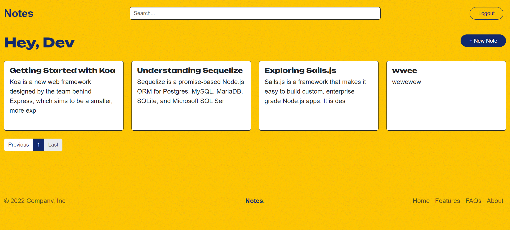
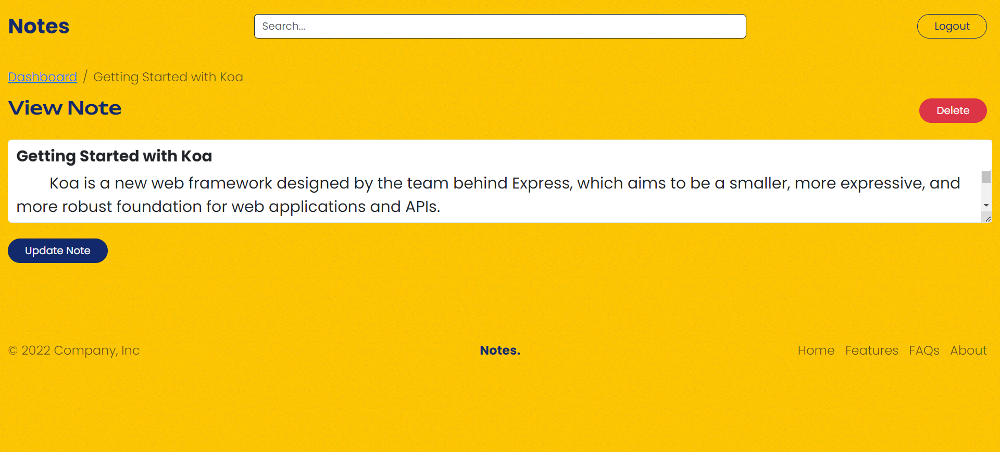

# Notes

## Overview
A note-taking application built with Express, MongoDB, EJS, and Passport for authentication. This app allows users to create, edit, and delete notes.

## Features
- User authentication with Google OAuth
- CRUD operations for notes
- Responsive design with EJS templating
- Session management with MongoDB

## Installation

### Prerequisites
- Node.js
- MongoDB
  
### Steps
1. Clone the repository:
    ```bash
    git clone https://github.com/your-username/your-repo-name.git
2. Navigate to the project directory:
    ```bash
    cd your-repo-name
3. Install dependencies:
    ```bash
    npm install
4. Create a `.env` file in the root directory and add the following variables:
    ```makefile
    SESSION_SECRET=your-session-secret
    MONGODB_URI=your-mongodb-uri
    GOOGLE_CLIENT_ID=your-google-client-id
    GOOGLE_CLIENT_SECRET=your-google-client-secret
    GOOGLE_CALLBACK_URI=http://localhost:5000/google/callback
    PORT=5000
5. Start the application:
    ```bash
    npm start
6.  Open your browser and navigate to `http://localhost:5000`.
## Usage
Register/Login: Use Google OAuth to register or log in.
Create Notes: Add new notes using the dashboard.
Edit/Delete Notes: Modify or remove notes from the dashboard.
## Screenshots


